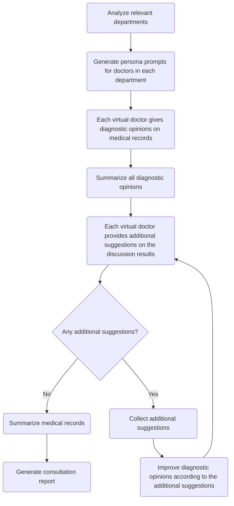

# ThreeSensei
Leverage large language model to conduct clinical consultation

[中文](README_zh.md) | English

This project attempts to use the approach of the LLM agent to solve complex reasoning problems in the clinical field. Taking the consultation scenario as an example, it theoretically supports other clinical decision support issues such as differential diagnosis, nursing care plan development, and risk assessment.

### How it works



### How to use

#### Configuration

Supports local models Llama, ChatGLM, Baichuan, and OpenAI API.

If using a local model, modify MODEL_PATH to the Hugging Face model name or the local cache directory in the `.env` file.

If using OpenAI API, modify OPENAI_API_TOKEN and OPENAI_MODEL_NAME in the `.env` file.

Model accuracy and inference parameters are also configured in the `.env` file. Local model loading accuracy supports full precision, float16, and int8.

#### Running

Loading medical record data from FILE_PATH as an example, and parameter lang can be "en" or "zh":
```
cd src
python cli.py --file_path=FILE_PATH
```
The running logs are saved in `log/*.log`, and the consultation report results are saved in `report/*.txt`.
