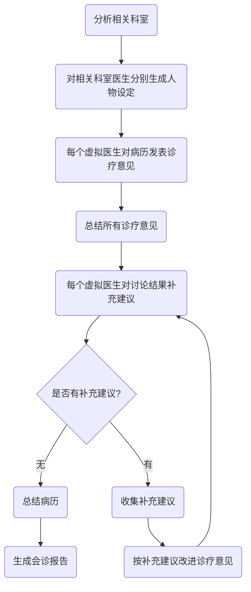

# ThreeSensei

中文 | [English](README.md)


这个项目尝试利用LLM agent的思路解决临床领域的复杂推理问题，以会诊场景为例，理论上也可支持鉴别诊断、护理计划制定、风险评估等其他临床决策支持问题。

## 工作机制



## 使用方式

### 配置

支持本地模型Llama、ChatGLM、Baichuan和OpenAI API。

如果加载本地模型，在`.env`文件里修改MODEL_PATH为huggingface model name或本地缓存目录。

如果使用OpenAI API，在`.env`文件里修改OPENAI_API_TOKEN和OPENAI_MODEL_NAME。

模型精度和推理参数也在`.env`文件里配置。本地模型加载精度支持全精度、float16和int8。

### 运行

以从FILE_PATH文件加载病历数据为例，参数lang可为zh或en：
```
cd src
python cli.py --file_path=FILE_PATH --lang=zh
```
运行日志保存在`log/*.log`里，会诊报告结果保存在`report/*.txt`里。
